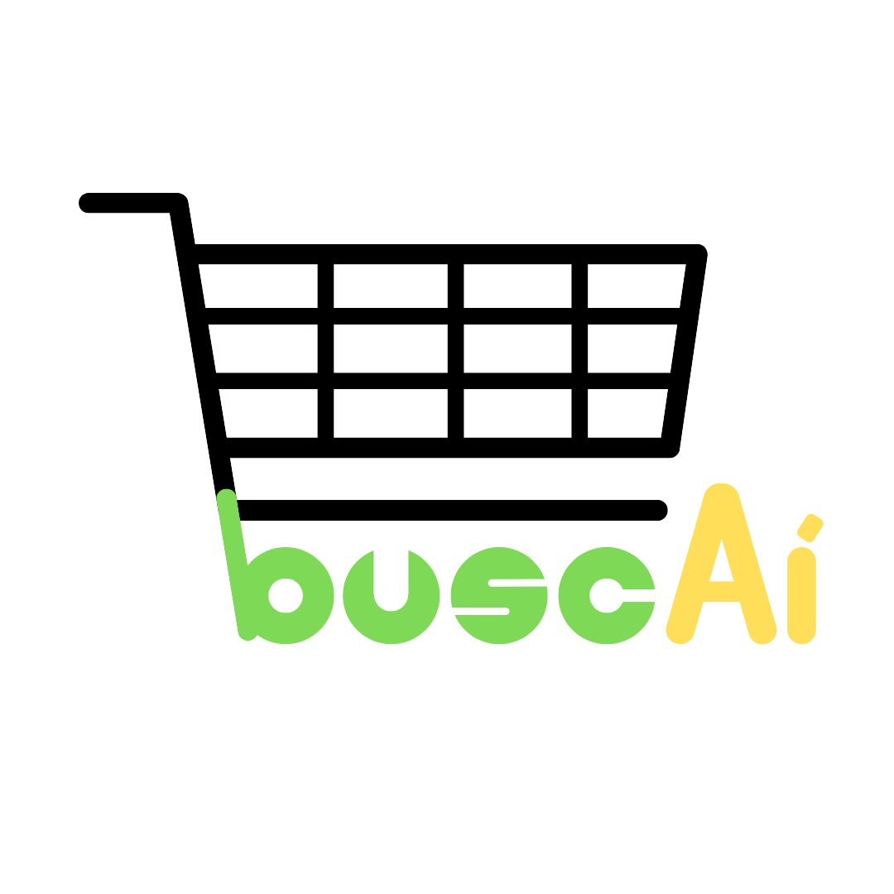

# BuscAi

**BuscAi** é uma plataforma digital para busca e comparação de preços de produtos em diferentes supermercados, projetada para ajudar os usuários a encontrar as melhores ofertas de acordo com suas preferências e localização. A aplicação facilita o acesso a informações de preços e disponibilidade de produtos, promovendo uma experiência prática e intuitiva.

## Funcionalidades

1. **Cadastro de Mercados e Produtos**
   - Mercados podem cadastrar produtos com detalhes de preço, categoria e disponibilidade.
   - Usuários podem consultar produtos específicos e comparar seus preços em diferentes mercados.

2. **Comparação de Preços**
   - Sistema de comparação de preços, permitindo ao usuário visualizar as melhores ofertas de acordo com critérios definidos.

3. **Filtro de Preferências**
   - Filtragem de resultados por preço, avaliações, marcas ou disponibilidade.

## Estrutura do Projeto

O projeto está organizado nas seguintes camadas:

- **DAO (Data Access Object)**: Manipulação e gerenciamento de dados para persistência no banco de dados.
   - **IDatabaseConnection**: Interface para conectar e desconectar do banco de dados.
   - **MySQLDatabaseConnection**: Implementação específica para o banco de dados MySQL.
   - **MercadoDAO e ProdutoDAO**: Realizam operações CRUD para as entidades `Mercado` e `Produto`.
- **Model**: Representação das entidades de negócio (como `Mercado`, `Produto` e `Avaliacao`), com atributos e métodos.
- **Services**: Lógica de negócios e funcionalidades principais.
   - **ComparadorDePrecos**: Classe para comparar preços de produtos em mercados.
   - **FiltroDePreferencias**: Métodos para filtrar produtos conforme disponibilidade, preço e marca.
   - **AplicativoBuscAi**: Classe principal que integra as funcionalidades do sistema.

## Tecnologias Utilizadas

- **Java**: Desenvolvimento do backend.
- **MySQL**: Banco de dados relacional para armazenamento de inform
